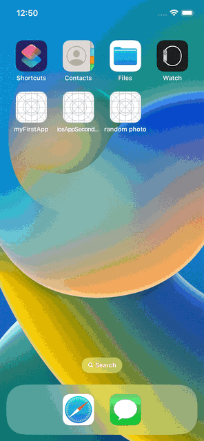

# random-photo

My first IOS app!

I followed https://www.youtube.com/watch?v=yuo50-TiKgo tutorial. The IOS app developed in swift programming language and uses https://unsplash.com/developers sdk to pull random images. When you press `Random Photo` button, it will shows random pic.

